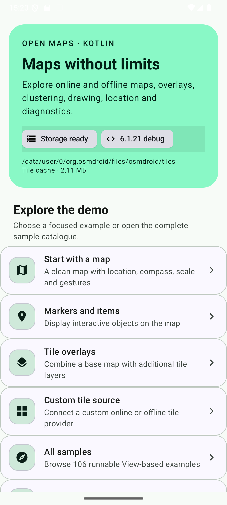
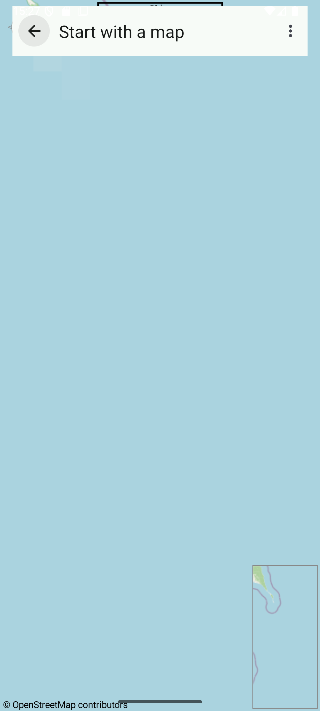
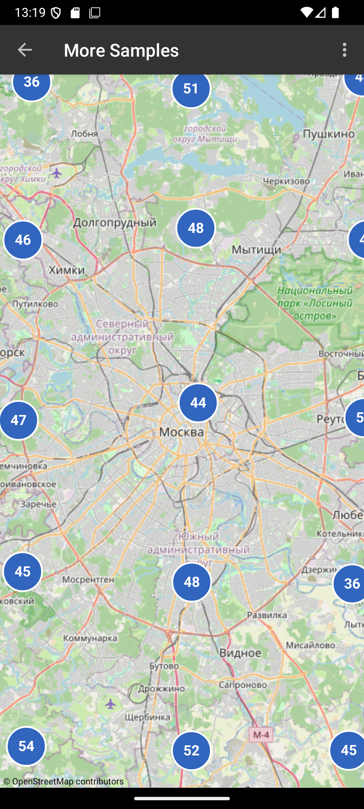

# inter-map — Kotlin MapView for Android

### A Kotlin-first continuation of osmdroid with offline maps, overlays and marker clustering

[](https://jitpack.io/#Khokhlinvladimir/inter-map)
[](https://github.com/Khokhlinvladimir/inter-map/actions/workflows/CI.yml)
[](https://kotlinlang.org/)
[](https://developer.android.com/about/versions/nougat)
[](LICENSE)

[Русская версия](README_RU.md) · [Download demo APK](https://github.com/Khokhlinvladimir/inter-map/releases/latest/download/inter-map-demo-v1.0.0-debug.apk) · [Latest release](https://github.com/Khokhlinvladimir/inter-map/releases/latest)

## Description

**inter-map** is an Android `MapView` for online and offline tiles, markers, shapes, location, WMS, Mapsforge and GeoPackage data. It is based on the final archived [osmdroid](https://github.com/osmdroid/osmdroid) source, synchronized through commit [`b491ee4`](https://github.com/osmdroid/osmdroid/commit/b491ee4b7), and completely migrated to Kotlin.

The library keeps the familiar osmdroid API while adding native grid marker clustering. The demo application uses Material 3 Views, Day/Night colors, dynamic color and current Google Material icons — without Compose.

> This is an independent community continuation, not an official `org.osmdroid` release.

## Visual showcase

<table>
  <tr>
    <td align="center"><strong>Modern sample catalog</strong><br></td>
    <td align="center"><strong>Starter map</strong><br></td>
    <td align="center"><strong>Marker clustering</strong><br></td>
  </tr>
</table>

## Main features

1. Kotlin API compatible with the established osmdroid model.
2. Online tiles and offline archives, cache and tile packaging tools.
3. Markers, polylines, polygons, location and custom overlays.
4. Linear-time Web Mercator marker clustering with antimeridian support.
5. WMS, Mapsforge, GeoPackage and shapefile integrations.
6. Material 3 View-based demo with 106 executable samples.
7. Android API 24+, Day/Night, dynamic colors and accessible map controls.

# Instructions for using inter-map

## Step 1: Install the library

Add JitPack at the end of the repositories list in `settings.gradle.kts`:

```kotlin
dependencyResolutionManagement {
    repositories {
        google()
        mavenCentral()
        maven(url = "https://jitpack.io")
    }
}
```

Add the core module to your application:

```kotlin
dependencies {
    implementation("com.github.Khokhlinvladimir.inter-map:osmdroid-android:v1.0.0")
}
```

## Step 2: Add and configure a map

```xml
<org.osmdroid.views.MapView
    android:id="@+id/map"
    android:layout_width="match_parent"
    android:layout_height="match_parent" />
```

```kotlin
val map = findViewById<MapView>(R.id.map)
map.setTileSource(TileSourceFactory.MAPNIK)
map.setMultiTouchControls(true)
map.controller.setZoom(12.0)
map.controller.setCenter(GeoPoint(55.751244, 37.618423))
```

Add network permissions to the application manifest when using online tiles:

```xml
<uses-permission android:name="android.permission.INTERNET" />
<uses-permission android:name="android.permission.ACCESS_NETWORK_STATE" />
```

## Step 3: Forward the lifecycle

```kotlin
override fun onResume() {
    super.onResume()
    map.onResume()
}

override fun onPause() {
    map.onPause()
    super.onPause()
}
```

## Step 4: Add a marker

```kotlin
val marker = Marker(map).apply {
    position = GeoPoint(55.751244, 37.618423)
    title = "Moscow"
    setAnchor(Marker.ANCHOR_CENTER, Marker.ANCHOR_BOTTOM)
}
map.overlays.add(marker)
map.invalidate()
```

## Step 5: Cluster large marker collections

```kotlin
val clusterer = GridMarkerClusterer(map).apply {
    maximumClusterZoom = 17.0
    addAll(markers)
}
map.overlays.add(clusterer)
```

The algorithm groups markers in screen-space cells using fractional Web Mercator zoom, preserves deterministic ordering and calculates a circular longitude centroid around the antimeridian. Cluster taps zoom into their contents.

## Optional modules

```kotlin
dependencies {
    implementation("com.github.Khokhlinvladimir.inter-map:osmdroid-wms:v1.0.0")
    implementation("com.github.Khokhlinvladimir.inter-map:osmdroid-mapsforge:v1.0.0")
    implementation("com.github.Khokhlinvladimir.inter-map:osmdroid-geopackage:v1.0.0")
    implementation("com.github.Khokhlinvladimir.inter-map:osmdroid-shape:v1.0.0")
}
```

| Module | Purpose |
| --- | --- |
| `osmdroid-android` | Core MapView, tiles, overlays, offline storage and clustering |
| `osmdroid-wms` | WMS client |
| `osmdroid-mapsforge` | Mapsforge rendering |
| `osmdroid-geopackage` | GeoPackage support |
| `osmdroid-shape` | Shapefile support |
| `OpenStreetMapViewer` | Full demo and regression catalog |
| `osmdroid-simple-map` | Minimal Android example |
| `OSMMapTilePackager` | Desktop tile packaging tool |
| `osmdroid-server-jdk` | JVM tile server |

## Build from source

Requirements: JDK 17, Android SDK 37 and Build Tools 36.0.0.

```bash
./gradlew clean build
./gradlew :OpenStreetMapViewer:installDebug
```

Publish all supported modules to Maven Local:

```bash
./gradlew publishToMavenLocal
```

## Verification

The Kotlin migration and clustering release passed:

- the complete Gradle build and GitHub Actions CI;
- core and extension JVM unit tests;
- **106/106** registered sample fragments on an Android 16 / API 36 emulator;
- **11/11** historical bug drivers;
- the remaining **13** Android instrumentation tests.

External tile servers, API-key services and local data endpoints remain environment-dependent and are not bundled with the library.

## Technical specifications

- Language: Kotlin 2.4.10
- Build: Gradle 9.5.1 and Android Gradle Plugin 9.3.0
- Java: JDK 17
- Minimum Android: API 24
- Compile SDK: 37
- Target SDK: 36
- UI demo: Material 3 Views, no Compose

## Project status

The original osmdroid repository is archived. Its [wiki](https://github.com/osmdroid/osmdroid/wiki), [upgrade guide](https://github.com/osmdroid/osmdroid/wiki/Upgrade-Guide), history and contributors remain the compatibility reference. Applications are responsible for complying with each selected tile provider's policy and attribution requirements.

## License

Distributed under the [Apache License 2.0](LICENSE), consistent with the upstream project. Repository history preserves individual contributions and attribution.

## Author

The Kotlin continuation is maintained by Khokhlin Vladimir. Telegram: [@vkhokhlin](https://t.me/vkhokhlin).

## Assistance

If you find a bug or want to improve the library, create a [GitHub issue](https://github.com/Khokhlinvladimir/inter-map/issues) or send a pull request.
